[#LocalEnv]:#using-local-environment
[#KeyVaultEnv]:#using-keyvault
[#TrySample]:#to-try-this-sample
 
# Authentication Bot using SSL/TLS certificates

Bot Framework v4 bot authentication using Certificate

This bot has been created using [Bot Framework](https://dev.botframework.com/), it shows how to use the bot authentication capabilities of Azure Bot Service.

In this guide, we'll explain how to create and consume a certificate in Bot Framework with the following options:
1. [Local environment][#LocalEnv]
2. [KeyVault][#KeyVaultEnv]

## Interacting with the bot

This sample uses the bot authentication capabilities of Azure Bot Service, providing features to make it easier to develop a bot that authenticates users using digital security certificates. You just need to provide the certificate data linked to the managed identity and run the bot, then communicate with it to validate its correct authentication.

## SSL/TLS certificate

An SSL/TLS certificate is a digital object that allows systems to verify identity and subsequently establish an encrypted network connection with another system using the Secure Sockets Layer/Transport Layer Security (SSL/TLS) protocol. Certificates are issued using a cryptographic system known as public key infrastructure (PKI). PKI allows one party to establish the identity of another through the use of certificates if they both trust a third party, known as a certificate authority. SSL/TLS certificates therefore function as digital identity documents that protect network communications and establish the identity of websites on the Internet as well as resources on private networks.

## Prerequisites

- [Ngrok](https://ngrok.com/) latest version.
- [.NET SDK](https://dotnet.microsoft.com/download) version 8.0

  ```bash
  # determine dotnet version
  dotnet --version
  ```

## To try this sample

  - Setup ngrok
    1. Follow this [guide](https://ngrok.com/docs/getting-started/?os=windows) to install and configure ngrok in your environment.
    2. Run ngrok with the following command.
       ```bash
       ngrok http --host-header=rewrite 3978
       ```

  - Setup a Bot
    1. Register a bot with Azure Bot Service, following the instructions [here](https://docs.microsoft.com/azure/bot-service/bot-service-quickstart-registration?view=azure-bot-service-3.0).
    2. After registering the bot, use `<NGROK_FORWARDING_DOMAIN>/api/messages` as the messaging endpoint.
        > NOTE: make sure to take note of the Microsoft App Id as we'll need this for later.

  - Clone the repository
      ```bash
      git clone https://github.com/microsoft/botbuilder-samples.git
      ```


Create and configure the SSL/TSL certificate. In this sample we use two possible options to create and set an SSL/TSL certificate. Below is a step-by-step description of each one:

### Using local environment
  1. Configure the following app settings variables:
     - MicrosoftAppId: App Id of your bot (gathered from the [Setup a Bot][#TrySample] step).
     - MicrosoftAppType: Type of the App (optional for MultiTenant apps).
     - MicrosoftAppTenantId: Tenant Id to which your bot belongs (optional for MultiTenant apps).
  
  2. Intall and configure [OpenSSL](https://www.openssl.org/source/) with the latest version.
     - Download the latest version source and add the folder to the [environment variables](https://www.java.com/en/download/help/path.html) path.
       ```bash
       setx path "%path%;<OpenSSL path here> 
 
       e.g:
       setx path "%path%;C:\Program Files\openssl-3.3.0"
       ```

  3. Run the following command in PowerShell
      - For **global environment certificate** execute the following command with **admin privileges**:
        ```powershell
        $cert = New-SelfSignedCertificate -CertStoreLocation "." -Subject "CN=<certificate-name>" -KeySpec KeyExchange
        ```
        e.g:
          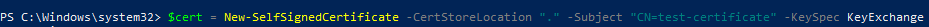

      - For **current user certificate** execute:
        ```powershell
        $cert = New-SelfSignedCertificate -CertStoreLocation "Cert:\CurrentUser\My" -Subject "CN=<certificate-name>" -KeySpec KeyExchange
        ```
        e.g:
          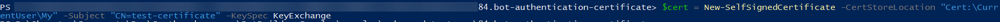

  4. Then, type _Manage computer certificates (global environment certificate)_ or _Manage User Certificates (current user certificate)_ in the Windows search bar and hit enter.
     
      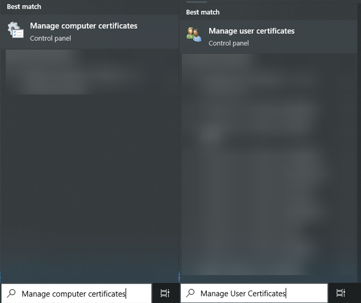

  6. The certificate will be located in the _user certificates_ folder, under _personal_ directory.
     
      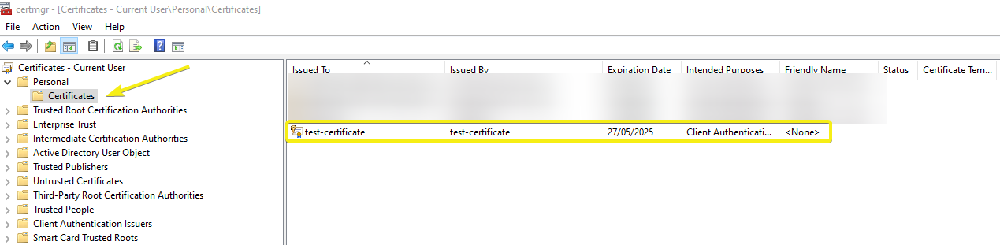

  8. Export the certificate to _pfx_ format including the key.
     
      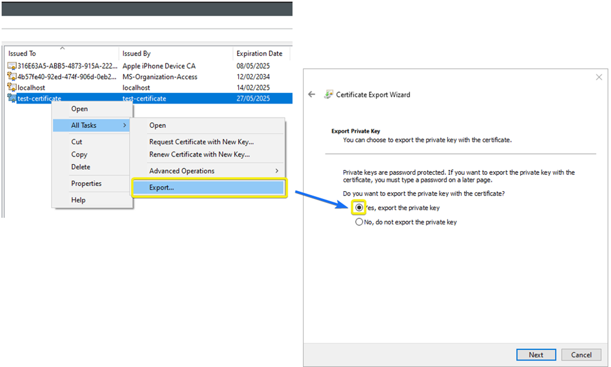
      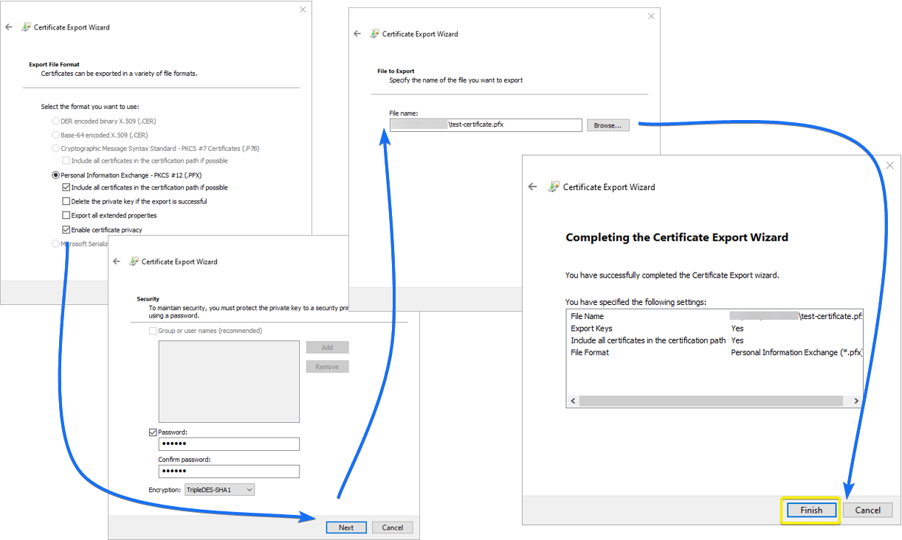

  10. Go to the certificate location and run the following command to generate a _pem_ file (the command will ask for the password generated in the previous step):
      ```powershell
      OpenSSL pkcs12 -in .\<certificate-name>.pfx -out <certificate-name>.pem –nodes -nokeys
      ```
      e.g:
        

  11. Upload the generated certificate to the Azure app registration.
      
      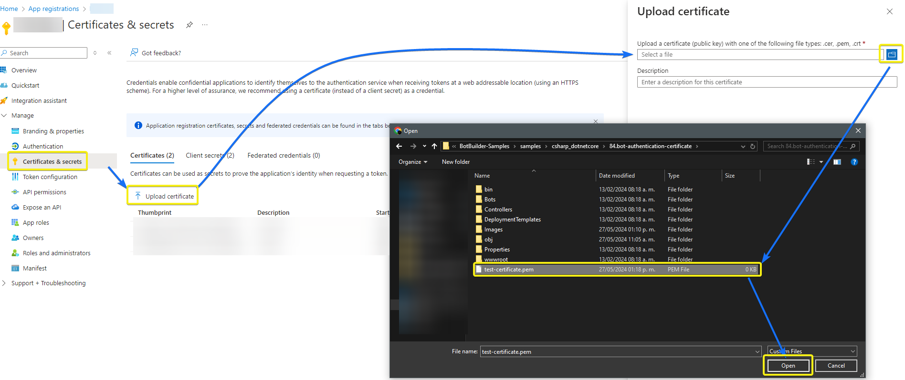

  13. To read the certificate in the bot, the _pem_ file must include the key, then go to the certificate location and run the following command to generate a _pem_ file with key:
      ```powershell
      OpenSSL pkcs12 -in .\<certificate-name>.pfx -out <certificate-with-key-name>.pem –nodes
      ```
      e.g:
        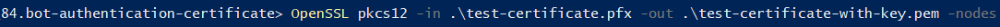

  14. In the sample code, go to the [Startup](Startup.cs) class and uncomment the line of code that reads the local certificate and write the name of the certificate in _pem_ format inside the _CreateFromPemFile_ method.
  Be sure to comment out or remove the lines of code that use Azure KeyVault to avoid errors.
      > NOTE: Here the value of MicrosoftAppId and MicrosoftAppTenantId are needed to generate the credentials.

      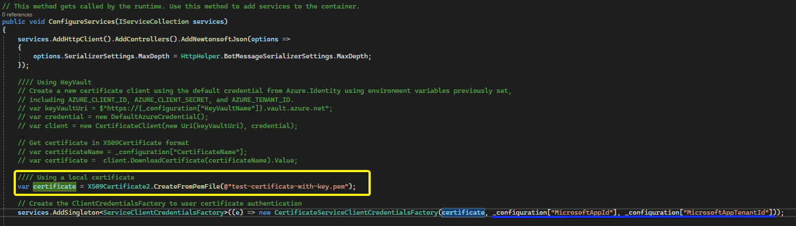

### Using KeyVault
  1. This option requires the following app settings variables:
     - KeyVaultName: Name of the KeyVault containing the certificate.
     - CertificateName: Name of the certificate in the KeyVault.
     - MicrosoftAppId: App Id of your bot (gathered from the [Setup a Bot][#TrySample] step).
     - MicrosoftAppType: Type of the App (optional for MultiTenant apps).
     - MicrosoftAppTenantId: Tenant Id to which your bot belongs (optional for MultiTenant apps).

  3. Create a [KeyVault](https://learn.microsoft.com/en-us/azure/key-vault/general/quick-create-portal) resource.
    
  4. Assign KeyVault [permissions](https://learn.microsoft.com/en-us/azure/key-vault/general/rbac-guide?tabs=azure-cli) to the current user if needed to create a new certificate.

  5. Under the Certificates section, hit on Generate/Import, complete the form, and create the certificate in _pem_ format.
      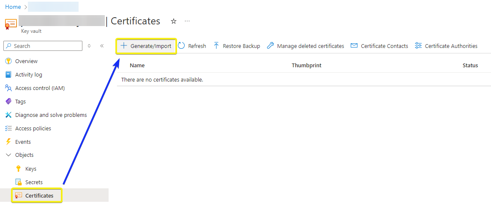
      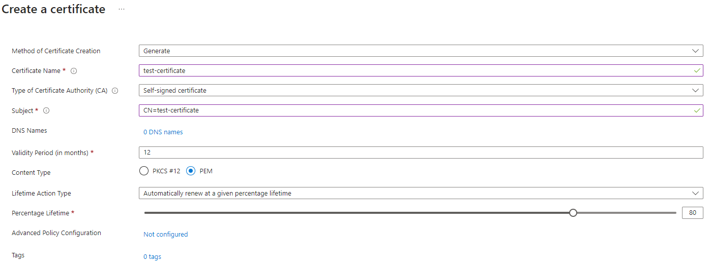

  6. Go to the details of the certificate and download it in _CER_ format to avoid the export of the private key.

      
      

      > NOTE: If you used _pkcs_ format in the creation step and downloaded it in _PFX_ format, install OpenSSL and follow the step 6 of the previous [section](#using-local-environment) to convert it to _pem_ format without keys.

      > NOTE: If you downloaded it in _PEM_ format, it will be neccesary to remove the private key by executing the following command:
        ```
        OpenSSL pkcs12 -in .\<certificate-name>.pem -export -out .\<certificate-without-key-name>.pem -nokeys
        ```
        e.g:
          


  7. Upload the certificate to the Azure app registration.
      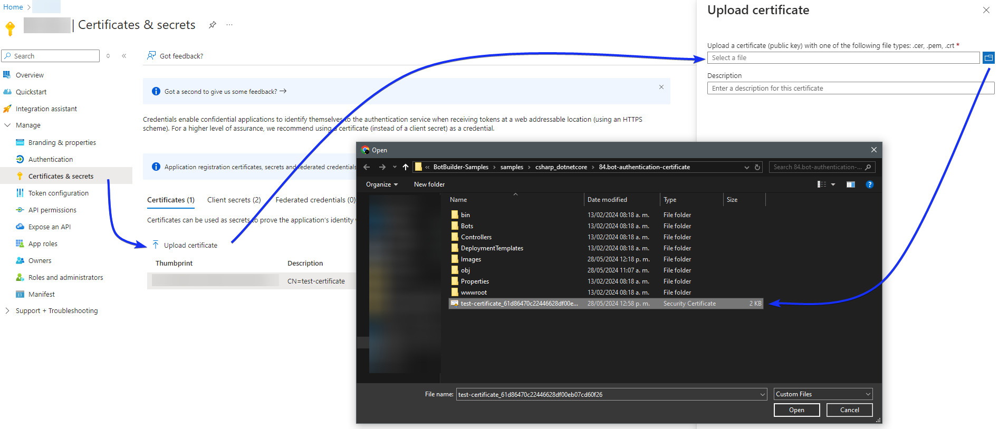

  8. In the sample code, go to the [Startup](Startup.cs) class and uncomment the line of code that reads the keyvault certificate and verify that the keyvault credentials are completed in the [appsettings](appsettings.json) file.
  Be sure to comment out or remove the lines of code that use local certificate to avoid errors.
      > NOTE: Here the value of `MicrosoftAppId` and `MicrosoftAppTenantId` are also needed to generate the credentials.

      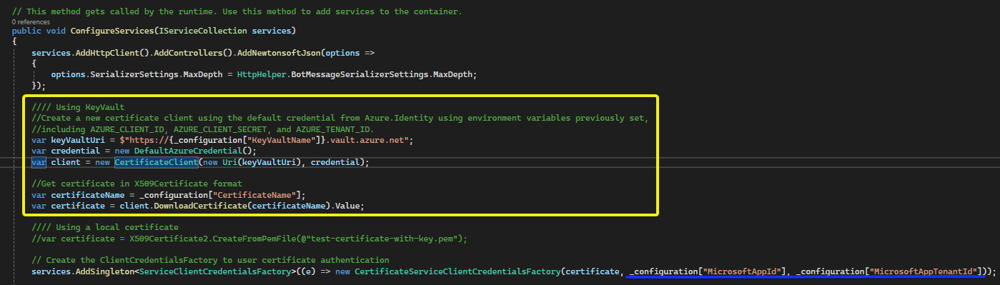

  9. In the current sample context, log into Azure to obtain the default credentials by executing the following command.
      ```powershell
      az login
      ```

### Run the bot from a terminal or from Visual Studio:
  - From a terminal, navigate to `samples/csharp_dotnetcore/84.bot-authentication-certificate` and execute:
      ```bash
      # run the bot
      dotnet run
      ```

  - Or from Visual Studio
    - Launch Visual Studio
    - File -> Open -> Project/Solution
    - Navigate to `samples/csharp_dotnetcore/84.bot-authentication-certificate` folder
    - Select `AuthCertificateBot.csproj` file
    - Press `F5` to run the project


## Testing the bot using Azure Bot

Go to the Azure bot resource created previously, select the _Test in Web Chat_ option under the _Settings_ section and start talking to the bot.


## Deploy the bot to Azure

To learn more about deploying a bot to Azure, see [Deploy your bot to Azure](https://aka.ms/azuredeployment) for a complete list of deployment instructions.

## Further reading

- [Bot Framework Documentation](https://docs.botframework.com)
- [Bot Basics](https://docs.microsoft.com/azure/bot-service/bot-builder-basics?view=azure-bot-service-4.0)
- [Azure Portal](https://portal.azure.com)
- [Activity processing](https://docs.microsoft.com/en-us/azure/bot-service/bot-builder-concept-activity-processing?view=azure-bot-service-4.0)
- [Azure Bot Service Introduction](https://docs.microsoft.com/azure/bot-service/bot-service-overview-introduction?view=azure-bot-service-4.0)
- [Azure Bot Service Documentation](https://docs.microsoft.com/azure/bot-service/?view=azure-bot-service-4.0)
- [.NET Core CLI tools](https://docs.microsoft.com/en-us/dotnet/core/tools/?tabs=netcore2x)
- [Azure CLI](https://docs.microsoft.com/cli/azure/?view=azure-cli-latest)
- [Azure Portal](https://portal.azure.com)
- [Channels and Bot Connector Service](https://docs.microsoft.com/en-us/azure/bot-service/bot-concepts?view=azure-bot-service-4.0)
- [SSL/TLS certificates](https://www.digicert.com/tls-ssl/tls-ssl-certificates)
